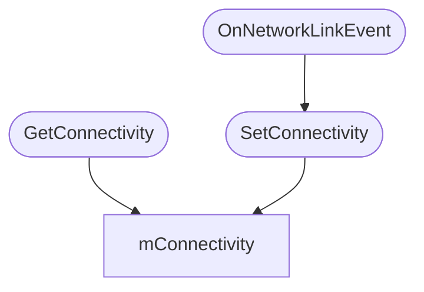
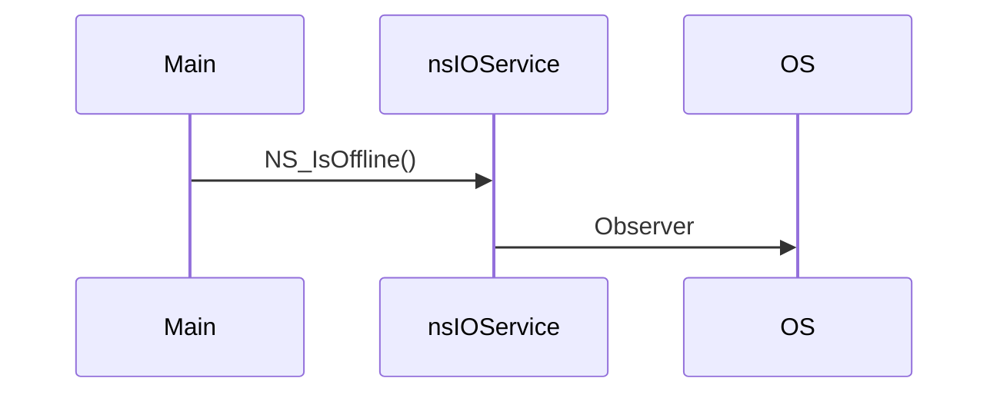

# `navigator.onLine`

This document discusses how is the [`navigator.onLine`](https://developer.mozilla.org/en-US/docs/Web/API/Navigator/onLine) API implemented in three mainstream browsers.

This API includes:

1. `onLine` property in `Navigator` and `WorkerNavigator`
2. `"online"` and `"offline"` events fired

## spec

> Returns false if the user agent is definitely offline (disconnected from the network). Returns true if the user agent might be online.
>
> The onLine getter steps are to return true if this's relevant settings object is offline is false; otherwise false.

`is offline` is defined in fetch spec:

> To check if the environment settings object environment is offline:
>
> - If the user agent assumes it does not have internet connectivity, then return true.
> - Return environment’s WebDriver BiDi network is offline.

## browsers

| Platform | Chromium                                           | Firefox                       | WebKit                                             |
| -------- | -------------------------------------------------- | ----------------------------- | -------------------------------------------------- |
| Linux    | netlink                                            | DBus `NetworkManager` netlink | GLib `get_network_monitor_get_network_available()` |
| macOS    | SystemConfiguration `SCDynamicStore`               | `SCNetworkReacability`        | `ScDynamicStore`                                   |
| Windows  | Win32 `Notify{Addr,Route}Change`, `IsNetworkAlive` | +1                            | `NotifyAddrChange`                                 |
| Android  | android.net `ConnectivityManager`                  | +1                            | ∅                                                  |
| iOS      | ∅                                                  | ∅                             | `CPNetworkObserver`                                |
| ohos     | ∅                                                  | ∅                             | ∅                                                  |

### chromium

### firefox

#### Navigator::OnLine

source: `dom/base/Navigator.cpp`.

```cpp
bool Navigator::OnLine() {
  // 1. check if ResistFingerprinting mode
  // 2. GetForceOffline() on browsingContext  <- webdriver of devtool
  // 3. NS_IsOffline() for system status
}
```

#### NS_IsOffline

source: `netwerk/base/nsNetUtil.cpp`.

```cpp
bool NS_IsOffline() {
  nsCOMPtr<nsIIOSService> ios = do_GetIOSerivce();
  ios->GetOffline(&offline);
  ios->GetConnectivity(&connectivity);
  return offline || !connectivity
}
```

Getters, source: `netwerk/base/nsIIOSetvice.cpp`.





```cpp
NS_IMETHODIMP
nsIOService::GetOffline(bool* offline) {
  // check internal offline mode, set by `SetOffline` for preference
}

NS_IMETHODIMP
nsIOService::GetConnectivity(bool* aConnectivity) {
  *aConnectivity = mConnectivity;  // mConn is updated by `SetConnectivity`
}
```

Callback, same file.

```cpp
nsresult nsIOService::OnNetworkLinkEvent(const char* data) {
  // 1. check mManageLinkStatus preference
  // 2. check data -> set isUp
  // 3.
  return SetConnectivityInternal(isUp);
}
```

Register

```
Observe
```

### webkit

## apis

### Linux netlink

### macOS

### Windows

### Android

### iOS

### ohos

## rust crates

searched keywords：network, online, offline.
